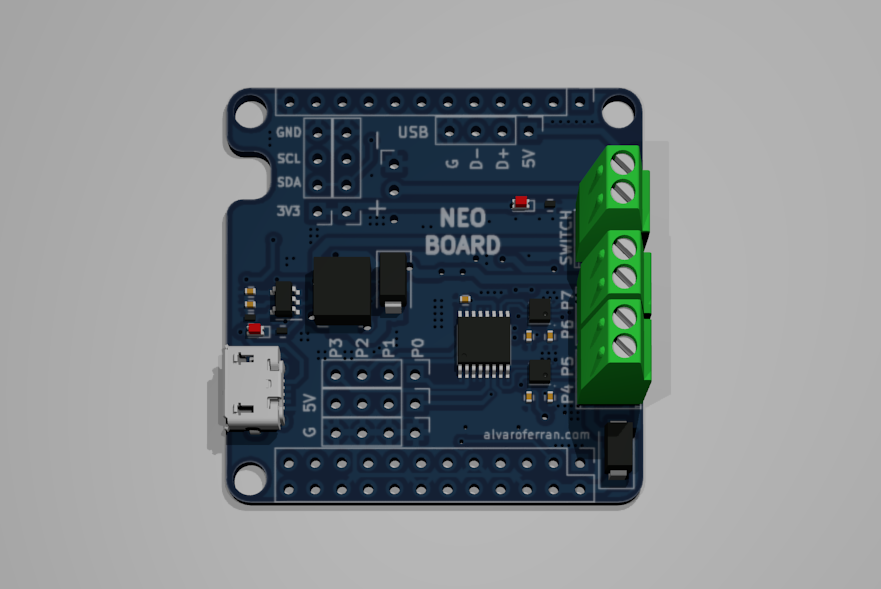
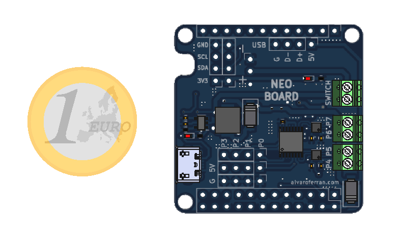

# NeoBoard

 

NeoBoard is a robotics controller shield for the [NanoPi Neo Air](http://nanopi.io/nanopi-neo-air.html) SBC. It can drive two DC motors, has four extra 5V GPIOs and an ADC to read the battery level from the Linux board. It also includes a 1S LiPo battery charger, a 3.5A boost circuit to ramp the voltage up to 5V for the motors and a hardware-based motor disconnect in case of low battery.

